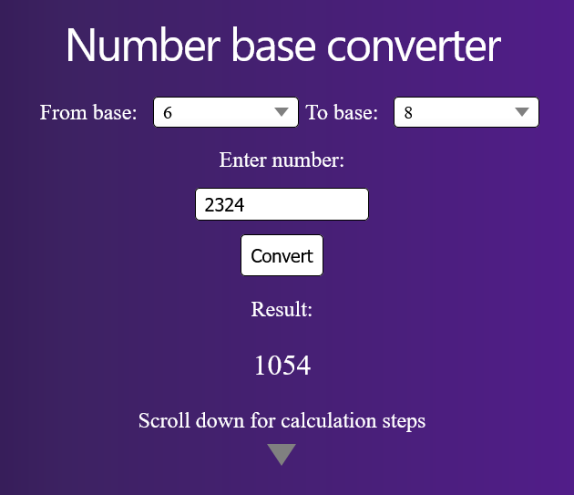
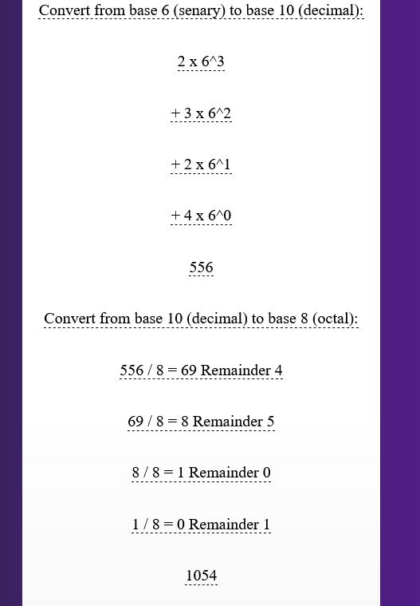

Number Base Converter

Angular-based app to convert numbers between different bases.

Work in progress. Currently:
- converts whole numbers from base 10 to bases 2 through 9 
- converts whole numbers from bases 2 through 9 to base ten
- converts whole numbers from non-decimal base to non-decimal base
- shows needed calculation steps to convert

Started work on splitting code into smaller components.

The main view for user input

The calculation steps shown to get result